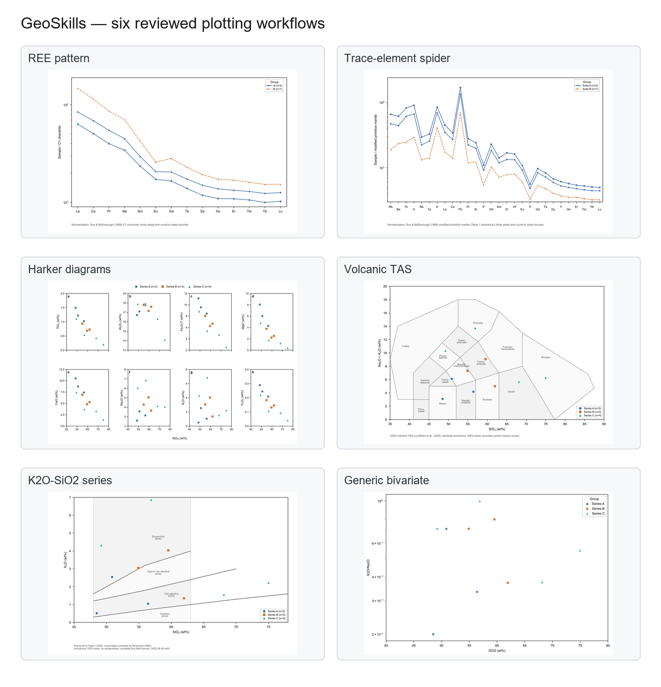

# GeoSkills

**English** | [简体中文](README.zh-CN.md)

[](https://github.com/gronbow/GeoSkills/actions/workflows/tests.yml)
[](https://github.com/gronbow/GeoSkills/actions/workflows/dependency-audit.yml)
[](LICENSE)

A local, model-provider-independent Agent Skill for geology and geochemistry.

Turn local tables into editable scientific figures. Review column mappings, units, and scientific parameters first, then generate SVG, PDF, TIFF, PNG, and quality-assurance reports in one workflow.

**Stable release:** [GeoSkills v0.8.0](https://github.com/gronbow/GeoSkills/releases/tag/v0.8.0). This branch contains the unreleased v0.9 development candidate.

[Quick start](#quick-start) · [Supported diagrams](#supported-diagrams) · [Installation](#installation) · [Workflow](#review-and-run) · [Troubleshooting](#troubleshooting) · [Changelog](CHANGELOG.md)



All gallery figures use public synthetic examples bundled with the repository, without real sample records or unpublished measurements.

## Quick start

1. Ask your assistant to use GeoSkills and provide the location of a local CSV, TXT, or XLSX file.
2. Specify the diagram you need. For an XY plot, identify the X/Y variables and whether each axis should be linear or logarithmic.
3. Review the proposed mappings, units, reference values, and output plan, then approve plotting.

Example request:

> Use GeoSkills to inspect my local geochemical table and prepare a chondrite-normalized REE plot. Show me the column mappings and normalization reference before plotting.

The default `shareable` profile omits plotted-data CSV files and suppresses sample identifiers in REE, spider, and XY figures. Group names remain visible in legends and should be reviewed before sharing. Numerical processing runs locally; plotting requires no model API or network service.

## Supported diagrams

| Diagram | Purpose | Publication layout |
|---|---|---|
| REE patterns | C1 chondrite-normalized La–Lu patterns | Single or double column |
| Trace-element spider diagrams | Primitive-mantle- or N-MORB-normalized patterns | Double column; single column with at most 14 elements |
| Harker diagrams | Major- or trace-element variation against a selected X variable | Double column; single column with at most 2 panels |
| TAS | Chemical classification of explicitly confirmed volcanic rocks | Single or double column |
| K2O–SiO2 | Magma-series comparison for explicitly confirmed volcanic rocks | Single or double column |
| Generic XY | Direct analytes or reviewed ratios with matching units | Single or double column |

The `publication-single-column` preset is **89 × 75 mm at 600 dpi**. Long reference notes are retained in JSON/QA reports instead of crowding the figure. The unified workflow uses full plot borders and automatically positions legends to reduce overlap.

Generic XY plots support independent linear or log10 axes. They do not supply isotope, tectonic-discrimination, or unreviewed classification boundaries.

## Installation

Download the [v0.8.0 source ZIP](https://github.com/gronbow/GeoSkills/archive/refs/tags/v0.8.0.zip), extract it, and locate `skills/geoskills`.

For a manual Codex installation, copy that folder into your personal skills directory:

| Environment | Destination |
|---|---|
| Windows default | `%USERPROFILE%\.codex\skills\geoskills` |
| Windows with a custom `CODEX_HOME` | `%CODEX_HOME%\skills\geoskills` |
| Linux/macOS default | `~/.codex/skills/geoskills` |
| Linux/macOS with a custom `CODEX_HOME` | `$CODEX_HOME/skills/geoskills` |

Start a new task after installation. Ask the assistant to check the local environment and explain any missing dependencies before installing them.

The portable skill entry point is [SKILL.md](skills/geoskills/SKILL.md). Its instructions and UI metadata are written in English. Some supporting references, diagnostics, and generated QA summaries are currently in Chinese; this release does not provide complete runtime localization.

### Developer setup

Run the following from the repository root using Python 3.11 or 3.12.

Windows PowerShell:

```powershell
python -m venv .venv
.\.venv\Scripts\python.exe -m pip install -r requirements-dev.txt
```

If Python is available through the Windows launcher, use `py -3.12 -m venv .venv` for the first command.

Linux/macOS:

```bash
python3 -m venv .venv
.venv/bin/python -m pip install -r requirements-dev.txt
```

The examples below use Windows paths. On Linux/macOS, use `.venv/bin/python` and forward slashes.

## Review and run

A **recipe** records the input file, mappings, units, scientific choices, tasks, output profile, and human confirmations. A **plan** is the reviewable check of that recipe before plotting.

```text
Local table + recipe → plan → human review → run → complete output bundle
```

Check the environment:

```powershell
.\.venv\Scripts\python.exe skills\geoskills\scripts\geoskills.py self-check
```

The [examples directory](skills/geoskills/examples) includes:

| Recipe | Tasks |
|---|---|
| `geoskills_ree_workflow.yaml` | REE patterns |
| `geoskills_spider_workflow.yaml` | Trace-element spider diagram |
| `geoskills_major_workflow.yaml` | Harker, TAS, and K2O–SiO2 |
| `geoskills_xy_workflow.yaml` | Generic XY plot |
| `user_recipe_template.yaml` | Your own data; all confirmations start disabled |

Prepare a plan for the synthetic major-element example:

```powershell
.\.venv\Scripts\python.exe skills\geoskills\scripts\geoskills.py plan skills\geoskills\examples\geoskills_major_workflow.yaml --output outputs\major-plan.json
```

Review `outputs/major-plan.json`, including its tasks, mapped variables, units, references, dimensions, output profile, and plan ID. When it is `ready` and approved, run:

```powershell
.\.venv\Scripts\python.exe skills\geoskills\scripts\geoskills.py run skills\geoskills\examples\geoskills_major_workflow.yaml --plan outputs\major-plan.json
```

The `--plan` option selects the plan file, not the figure directory. The recipe's `output.directory` is resolved relative to the recipe file. This example writes figures to `skills/geoskills/examples/generated/geoskills-major-workflow/`.

| Status | Meaning |
|---|---|
| `ready` | The command completed without an outstanding review condition; approve a ready plan before running it |
| `needs_confirmation` | Required human confirmation is missing |
| `blocked` | A validation or safety condition prevents completion |
| `review` after a run | Figures were generated, but scientific review is still needed, such as for boundary samples |

Do not copy the example confirmations to your own data. They apply only to the bundled synthetic examples. Begin with `user_recipe_template.yaml` and review every confirmation.

Changes to the recipe, input, software version, style, or scientific assets invalidate old plans. Generate and review a new plan before continuing.

## Data handling and exports

- Read CSV, comma- or tab-delimited TXT, and XLSX tables. Require an explicit worksheet when a workbook contains several sheets.
- Support one sample per row and conservatively transpose unambiguous tables with samples in columns.
- Summarize missing values, below-detection-limit entries, duplicate/blank sample IDs, non-numeric values, infinities, and nonpositive values as counts in shareable reports.
- Apply optional oxide-total checks only with a user-specified oxide list, range, and composition basis.
- Normalize an explicitly reviewed oxide list to an anhydrous 100% basis in a working copy. Original columns remain unchanged.
- Calculate deterministic ratios such as `Nb/Y` and `K2O/Na2O` only when the declared units match.
- Enforce table, raster, point, group, and drawing-object budgets before plotting. Oversized tasks are rejected without silently sampling data or merging groups.
- Commit multi-task results as one complete directory. A failed task does not replace the previous complete bundle.

| Output profile | Files | Data handling |
|---|---|---|
| `shareable` (default) | SVG, PDF, TIFF, PNG, JSON, QA Markdown | Omits plotted-data CSV and sensitive identifiers from reports |
| `local-reproducible` | The same files plus plotted-data CSV | Retains sensitive plotted values for local reproducibility |

The unified workflow exports editable SVG/PDF and high-resolution PNG/TIFF. TIFF uses RGB with LZW compression. Figure dimensions and resolution remain subject to the selected preset and validation limits.

Shareable plans and reports omit absolute paths, sample identifiers, exact source values, source filenames, worksheet names, and source-column labels. Selected-group values are represented by counts and a digest in reports; group names remain visible in figures. Figures still disclose scientific measurements and patterns, so `shareable` is not a substitute for permission to publish research data.

The `plotted_data_export_reviewed` confirmation acknowledges the selected export consequences. It does not authorize uploading data to a model or third-party service. Formula-like sample/group labels block `local-reproducible` CSV export.

In the v0.9 candidate, duplicate source headers stop input processing with `E110`. Overwriting an existing run verifies its inventory, file sizes, SHA-256 hashes, and root QA summary. Added, missing, or edited files stop replacement with `E826`; choose a new output directory to preserve your changes.

## Scientific boundaries

- **REE and spider references:** use the versioned Sun & McDonough (1989) tables. Reference assets record provenance, units, element order, and review information.
- **Primitive mantle:** keep the printed Table 1 values (`pm-sm89`) distinct from the footnote-modified variant (`pm-sm89-modified`). `nmorb-sm89` is also available. Never select a reference from the shape of a curve.
- **Units and conversions:** direct elemental concentrations require explicit ppm units. Only explicitly declared wt% K2O, P2O5, and TiO2 may be converted to elemental K, P, and Ti ppm using the reviewed conversion.
- **Missing data:** preserve missing and below-detection-limit values as gaps. Do not replace them with zero or invented detection limits. Nonpositive values cannot be plotted on logarithmic axes.
- **Harker:** show covariation without automatically fitting regressions or inferring a unique petrogenetic process.
- **TAS:** require explicit volcanic applicability and composition basis. Boundary cases require review. Results on an `as-reported` basis are provisional and require `provisional_classification_accepted: true`.
- **K2O–SiO2:** use the Peccerillo–Taylor (1976) boundaries with Rickwood's (1989) correction, without extrapolation. Require an explicitly confirmed anhydrous basis and volcanic applicability. Complete four-field classification is limited to SiO2 **48–63 wt%**.
- **Additional classification diagrams:** Zr/TiO2–Nb/Y coordinate calculations have been tested, but no classification model is registered for that diagram. New boundaries require source verification and separate scientific review.
- **Interpretation:** enrichment, depletion, slopes, clusters, and correlations alone do not uniquely establish source, melting, fractionation, alteration, or tectonic setting.

Inspect figures at their intended final size and check the target journal's requirements. Automated tests do not replace scientific review or visual approval.

## Troubleshooting

| Issue | What to do |
|---|---|
| Missing dependencies | Run `self-check`, review the missing packages, and install them in the local environment |
| Multiple worksheets | Select the intended worksheet explicitly |
| Duplicate headers (`E110`, v0.9 candidate) | Rename ambiguous columns in a local copy, then review the mappings |
| Existing output rejected (`E826`) | Keep the old directory and select a new output location |
| Stale plan | Generate and approve a new plan after changing data, recipe, or software |
| Single-column density limit | Use a double-column preset or split the tasks |
| Scientific review status | Read the task report; a boundary or applicability warning is not necessarily a plotting failure |

Additional references (currently in Chinese):

- [Beginner troubleshooting](docs/troubleshooting.md)
- [Recipes and safe execution](skills/geoskills/references/workflow-and-recipe.md)
- [Data QA, composition basis, and derived variables](skills/geoskills/references/data-quality-and-derived-variables.md)
- [K2O–SiO2 scientific contract](skills/geoskills/references/k2o-sio2-method.md)
- [v0.9 candidate audit and roadmap](docs/audits/v0.9-candidate-audit.md)
- [Historical v0.8 audit](docs/audits/v0.8-candidate-audit.md)

<details>
<summary>Advanced: legacy v0.3 command-line workflows</summary>

The original inspection, normalization, REE, spider, Harker, and TAS scripts remain available. Prefer the unified workflow for explicit mapping, reviewable plans, privacy profiles, and complete multi-task outputs.

Inspect and normalize the synthetic REE data:

```powershell
.\.venv\Scripts\python.exe skills\geoskills\scripts\inspect_data.py skills\geoskills\examples\synthetic_ree_data.csv
.\.venv\Scripts\python.exe skills\geoskills\scripts\normalize_ree.py skills\geoskills\examples\synthetic_ree_data.csv --output outputs\synthetic_ree_normalized.csv
```

Plot REE with full borders and an automatically placed internal legend:

```powershell
.\.venv\Scripts\python.exe skills\geoskills\scripts\plot_ree.py skills\geoskills\examples\synthetic_ree_data.csv --output-dir outputs\ree_figure --axes-frame full --legend-layout inside-auto
```

Inspect and plot a spider diagram:

```powershell
.\.venv\Scripts\python.exe skills\geoskills\scripts\inspect_spider_data.py skills\geoskills\examples\synthetic_spider_data.csv
.\.venv\Scripts\python.exe skills\geoskills\scripts\plot_spider.py skills\geoskills\examples\synthetic_spider_data.csv --reference pm-sm89-modified --output-dir outputs\spider_figure
```

Inspect major-element data and generate the default eight-panel Harker plot:

```powershell
.\.venv\Scripts\python.exe skills\geoskills\scripts\inspect_major_data.py skills\geoskills\examples\synthetic_major_element_data.csv
.\.venv\Scripts\python.exe skills\geoskills\scripts\plot_harker.py skills\geoskills\examples\synthetic_major_element_data.csv --x SiO2 --y TiO2,Al2O3,Fe2O3T,MgO,CaO,Na2O,K2O,P2O5 --output-dir outputs\harker_figure
```

Generate TAS only after reviewing volcanic applicability and composition basis:

```powershell
.\.venv\Scripts\python.exe skills\geoskills\scripts\plot_tas.py skills\geoskills\examples\synthetic_major_element_data.csv --confirm-volcanic --composition-basis anhydrous-normalized --output-dir outputs\tas_figure
```

Legacy commands preserve the original input. Reusing output names requires explicit `--overwrite`. Their exports do not acquire the unified workflow's privacy guarantees merely by using the same data.

</details>

## Project structure

```text
GeoSkills/
├── README.md                 English project entry point
├── README.zh-CN.md           Chinese README
├── CHANGELOG.md
├── SECURITY.md
├── AGENTS.md
├── requirements-dev.txt
├── docs/
├── skills/geoskills/
│   ├── SKILL.md
│   ├── agents/openai.yaml
│   ├── assets/
│   ├── examples/
│   ├── references/
│   └── scripts/
│       ├── geoskills.py
│       └── geoskills_core/
└── tests/
```

## Development status and security

v0.8.0 was released on 2026-08-31 with six diagram types, single-column output, input budgets, and CSV export protection. Its release regression recorded 283 passing tests and 1 skip. The v0.9 candidate has separate validation evidence in its audit report.

GeoSkills is a local Skill and command-line tool; it currently has no standalone web application. Main project documentation is maintained in English, with [README.zh-CN.md](README.zh-CN.md) as the Chinese entry point.

Local research directories (`local_data/`, `localdata/`), generated output, and local environment secrets are excluded from Git in this candidate. Never commit private research data or credentials.

Report security issues through the private process in [SECURITY.md](SECURITY.md). Do not put real data or vulnerability details in public issues.

## License

The code is available under the [MIT License](LICENSE).
